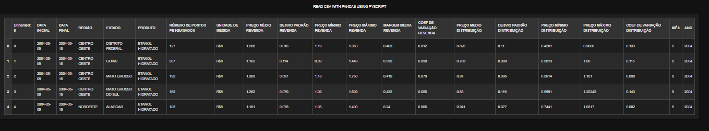
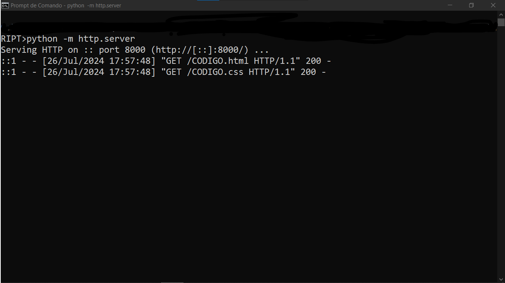

# CSV COM PANDAS E PYSCRIPT
👨‍🏫ESTE PROJETO DEMONSTRA COMO EXIBIR UM ARQUIVO CSV USANDO O PYSCRIPT E A BIBLIOTECA PANDAS.

 <br>
 <br>

## DESCRIÇÃO
Este projeto demonstra como ler e exibir um arquivo CSV usando o **PyScript**, uma tecnologia que permite executar código Python diretamente no navegador, e a biblioteca **Pandas** para manipulação de dados. A página web criada possui um estilo escuro e responsivo, garantindo uma visualização adequada em diferentes dispositivos.

## COMO FUNCIONA?
1. **Importação de Dados**: O script PyScript utiliza a biblioteca `pandas` para ler um arquivo CSV localizado em um servidor web. O arquivo CSV deve ser acessível via URL.
   
2. **Exibição de Dados**: O conteúdo do arquivo CSV é carregado em um DataFrame do Pandas e convertido em uma tabela HTML que é exibida na página web.

3. **Estilo e Responsividade**: O CSS aplicado garante que a página tenha um tema escuro e que a tabela seja responsiva, ajustando-se para telas de diferentes tamanhos.

## EXECUTANDO O PROJETO:
1. **Inicie o Servidor Web Local**
   - Navegue até o diretório `./CODIGO` e execute o seguinte comando no terminal:

   ```bash
   python -m http.server
   ```

   - Isso iniciará um servidor web local na porta 8000 por padrão.

2. **Acesse a Página**
   - Abra um navegador web e acesse a seguinte URL: [http://localhost:8000/CODIGO.html](http://localhost:8000/CODIGO.html)

   - A página será carregada e você verá o conteúdo do arquivo CSV exibido em uma tabela com estilo escuro.

3. **Visualize os Dados**
   - A tabela será exibida na área designada da página. O CSS aplicado garantirá que a tabela seja exibida com um fundo escuro e texto claro, e que seja responsiva em diferentes tamanhos de tela.

## NOTAS:
- **Formato do CSV**: Certifique-se de que o arquivo CSV utiliza o delimitador correto (no caso deste projeto, o delimitador é `;`).
- **Modificações**: Você pode modificar o estilo CSS e o código PyScript conforme necessário para ajustar a aparência e o comportamento da página.
- **Compatibilidade**: O PyScript pode ter algumas limitações de compatibilidade dependendo do navegador e da versão usada.

## NÃO SABE?
- Entendemos que para manipular arquivos em `HTML`, `CSS` e outras linguagens relacionadas, é necessário possuir conhecimento nessas áreas. Para auxiliar nesse aprendizado, oferecemos cursos gratuitos disponíveis:
* [CURSO DE PYSCRIPT](https://github.com/VILHALVA/CURSO-DE-PYSCRIPT)
* [CURSO DE HTML E CSS](https://github.com/VILHALVA/CURSO-DE-HTML-E-CSS)
* [CURSO DE PANDAS](https://github.com/VILHALVA/CURSO-DE-PANDAS)
* [CONFIRA MAIS CURSOS](https://github.com/VILHALVA?tab=repositories&q=+topic:CURSO)

## CREDITOS:
- [O DATABASE.CSV FOI EXTRAIDO DO CURSO DE PANDAS](https://github.com/VILHALVA/CURSO-DE-PANDAS)
- [PROJETO CRIADO PELO VILHALVA](https://github.com/VILHALVA)
